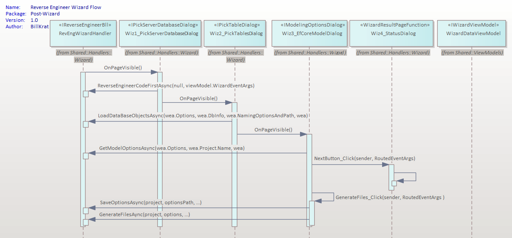

# EF Core Power Tools

Reverse engineering and model visualization tools for EF Core in Visual Studio 2022.

The Reverse Engineering (experimental) process aims to improve the developer UX

[Main README.md](README.md)

# Reverse Engineering Wizard
Below is a 20k foot overview of the four wizard pages that comprise the wizard steps.  It is beyond the scope of this
document to go into great detail, however topics that impacted the development process will be addressed.

 

Figure 1

## Gap analysis
During the gap analysis, with the goal of making as few code changes as possible, it was found that the 
ReverseEngineerHandler was the main class that managed the loading of the primary view dialogs for the reverse
engineering process.   

Each of the three main view dialogs: PickServerDatabaseDialog, PickTableDialog, and EfCoreModalDialog, 
had their own interfaces and view models.  The views handled the processing and returned results that would be used
by the ReverseEngineerHandler to process subsequent views.

The path forward was to copy the ReverseEngineerHandler, name the copy RevEngWizardHandler, and provide it an interface
IReverseEngineerBll [using the handlers function names].  The wizard pages would simply see the implementation of
IReverseEngineerBll as an instance that can later be easily replaced.  Currently, via the interface instance the wizard 
pages are recursively invoking the methods on the handler - effectively reusing existing code.

To assist in maintaining state, and minimizing any code changes, the new WizardDataViewModel contains the 
properties of the existing three view models, and provides an instance of a WizardEventArgs which is an EventArg 
designed to maintain state, it is passed to each wizard page.  

The WizardDataViewModel is shared between all wizard pages.  Since all of the existing XAML (from the three view dialogs noted above) were copied to the new 
pages with a "wiz" prefix, it effectively allowed the views to work with the new shared view model with no real code changes.

### 20k foot process flow
The RevEngWizardHandler (using Microsoft's wizard infrastructure) will hit Wiz1_PickServerDatabaseDialog resulting in the 
OnPageVisible() function being invoked. As the [Next] button is clicked, the subsequent page OnPageVisible() will be 
invoked which in turn invokes the applicable method on the implementation of the BLL instance [RevEngWizardHandler].

Note with the wiz3_EfCoreModelDialog view that we stray from this pattern.  Instead, we invoke NextButton_Click() 
which in turn invokes the status page and then invokes the GenerateFiles_Click() function.  This is because we initially
had only the three pages [consistent with original design].  Later, we added the status page which only needed to show 
the results of the third page, so instead of refactoring the code the data was set on the shared WizardDataViewModel 
which made it available on the last status page.

### About OnPageVisible()...
In a perfect world we would be able to tap into the page loaded event and start processing.  Unfortunately, like WinForms
the WPF framework does not behave as expected once you put a load on it.  e.g., the wizard worked great until we 
actually requested data.  Once there was a data request the UI froze (lower priority) and it wouldn't resume until
the data processing was completed.   So upon clicking "Next", the page would not advance and you wouldn't see
the helpful status bar message UNTIL the data process was complete, which wasn't very useful.

In the WinForm world we could request a DoEvents() and it would give the UI a chance to breathe (catch up); there
is an equivalent in the WPF world.  Instead of duplicating the wheel, I found an awesome StatusBar control by Rick Strahl
on GitHub that did all the heavy lifting in a cool way.  I added the main bits to EFCorePowerTools project under the 
Westwind.WPF.Statusbar folder since it wasn't going to be a plug'n play with NuGet.  This allowed me to make some minor 
modifications so that the UI would have a chance to breathe, move to the next page, and refresh the statusbar, 
BEFORE it started the heavy lifting - the Statusbar raises an event which invokes the OnPageVisible() event.  I also 
tweaked Rick's code to give the UI a chance to breathe before continuing (a heavier WPF DoEvents process).   

HOWEVER, great care needs to be taken that the status bar is not accessed while accessing the BLL asynchronously, we 
can't be in a new thread switching back to the UI thread and have two threads using the UI thread at the same time - 
age old issue with DoEvents and WPFs underpinnings - would be nice if they provided a safe OnPageVisible()...  To this
purpose you'll find I keep the code very tight when I'm invoking the BLL code asynchronously in my OnPageVisible functions.
Note that the BLL cannot access the status bar (reference code in red). 

EFCorePowerTools wizard framework attempts to establish a pattern that takes this heavy lifting off our plate should 
additional pages be required.

Figure 2

## Original Code UML
These diagrams are not all inclusive, but will provide a high level view of applicable classes and primary processes invoked.
### Choose Your Data Connection (wiz pg 1)

Figure 3

### Choose Your Database Objects (wiz pg 2)

Figure 4

### Choose Your Settings For Project (wiz pg 3)

Figure 5

