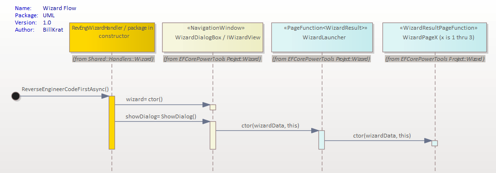
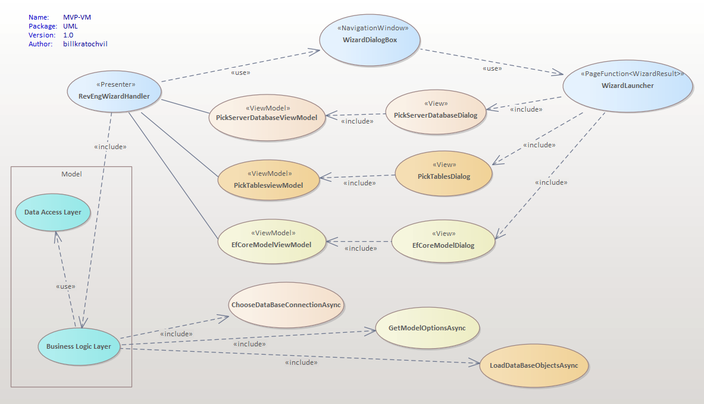
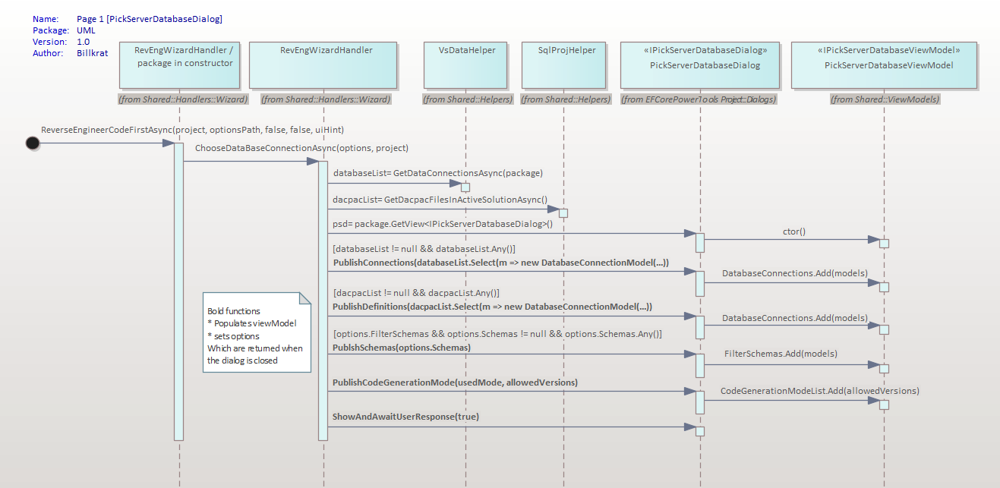
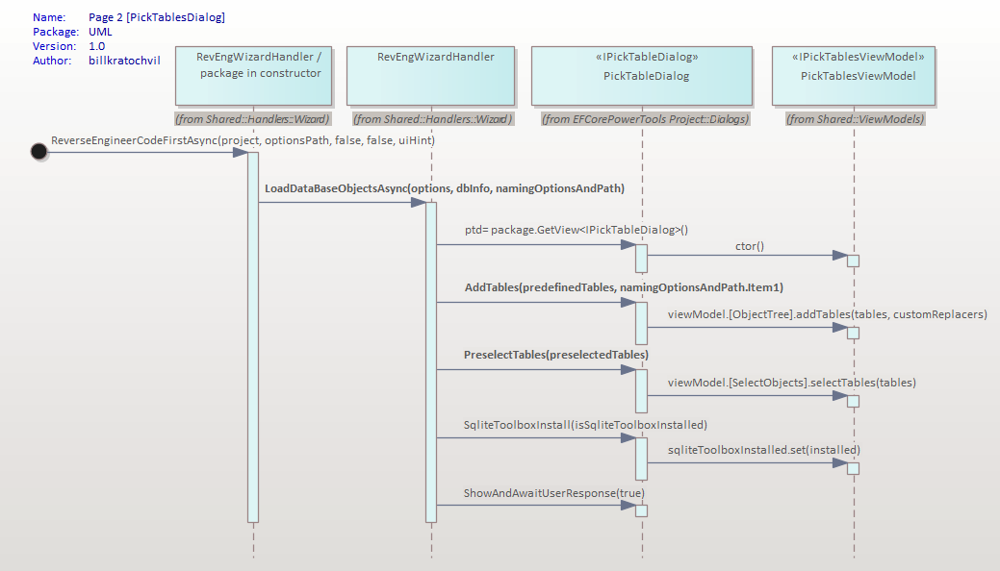
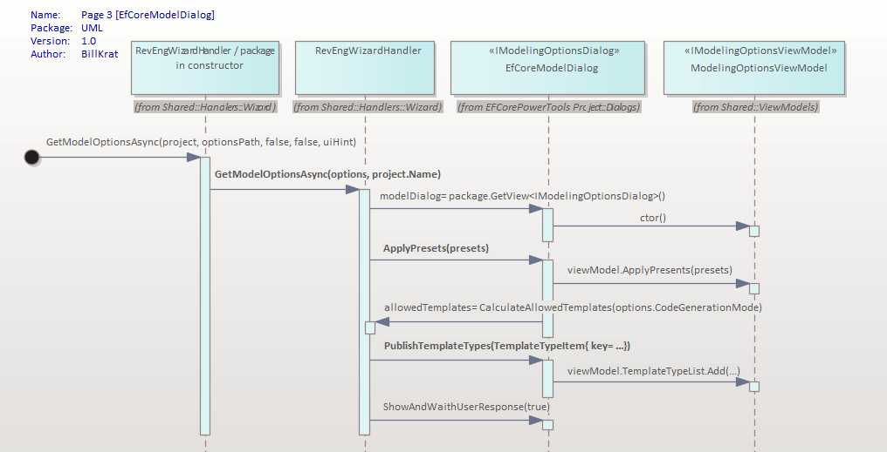

# EF Core Power Tools

Reverse engineering and model visualization tools for EF Core in Visual Studio 2022.

The beta process aims to improve the developer UX

[Main README.md](README.md)

# Reverse Engineering Wizard
The following demonstrates the wizard at work, don't be distracted by the design or colors as XAML can be
easily configured to look as required.  At this point it is a POC to demonstrate that a wizard can be used within
the existing EFCorePowerTools project.  The code for the wizard comes from the https://github.com/microsoft/WPF-Samples 
project [Windows/Wizard folder] - refactored for our purposes.

Where the patterns and design are subject to discussion and approval, the proposed path would be to use the MPV-VM pattern
[as much as possible] to more effectively utilize the POC wizard framework.  Unlike true MVP-VM, much of the View code-behind
logic may remain in-tact to minimize the refactor effort.

<video autoplay loop width="800" controls>
  <source src="img/mvpvm-demo.mp4" type="video/mp4">
</video>

The sequence diagram below relects a high level view of the primary classes, note that below each timeline
(gray text) the location of the class is displayed, e.g., RegEngWizardhandler.cs is under the Shared / Handlers / 
Wizard folder.

Figure 1 

# MVP-VM
The pattern suggested is the Model-View-Presenter, View-Model pattern.   The current design lends itself to this because
it isn't a true MVVM pattern; the handler actually performs much of the business logic communicating through the View.
MVVM is more a "widget" pattern that mirrors MVC (Model-View-Controller).  Like MVC, the View and ViewModel contain all of the code
and are generally not easily reused because of the tight coupling, nor do they easily communicate with other widgets. 
Note: MVC evolved to MVP (Model-View-Presenter pattern to overcome these limitations).   MVP, like MVP-VM is more of a 
framework pattern (required for our use case).

## Presenter (RevEngWizardHandler)
The presenter has primary responsibility for communicating with the business logic layer to populate the view model(s).
This pattern allows the views and view models to remain decoupled (lending to easier reuse and unit testing); Views
and view models do not access the business and/or data layers directly.
## Model 
Business and data access layers compose the model (in the MVC days it might have been referred to as application model).  
The presenter will use the business logic layer to populate the view models as required.   The business logic layer is 
the only component(s) that communicate with the data
access layer.
## Views / View Models
The views reflect the data that is on its ViewModel. Outside of the UI behavior logic there is generally no business 
logic within the view code-behind.  Under MVP-VM it is easy to reuse views, and view-models, with other 
views and view-models as there is no coupling (the presenters do all the work). 

For more indepth information you can visit my [MVPVM Design Pattern - The Model-View-Presenter-ViewModel Design Pattern for WPF (2011)](https://learn.microsoft.com/en-us/archive/msdn-magazine/2011/december/mvpvm-design-pattern-the-model-view-presenter-viewmodel-design-pattern-for-wpf) 

Figure 2

# High level UML for current design 
These diagrams are not all inclusive but will provide a high level view of applicable classes and primary processes invoked.
## Page 1 - Choose Your Data Connection

Figure 3

## Page 2 - Choose Your Database Objects

Figure 4

## Page 3 - Choose Your Settings For Project

Figure 5

